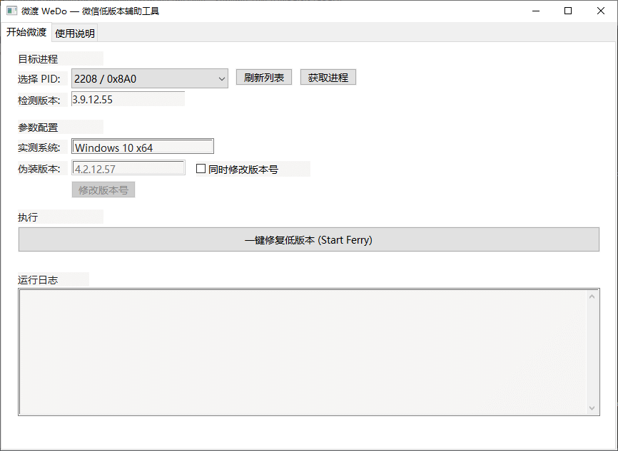
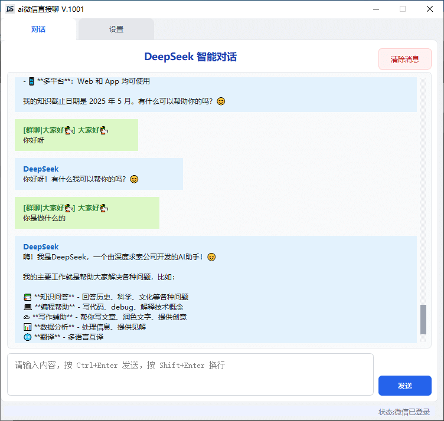
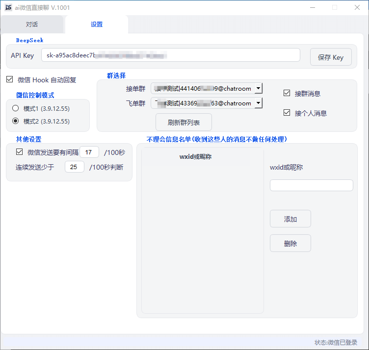
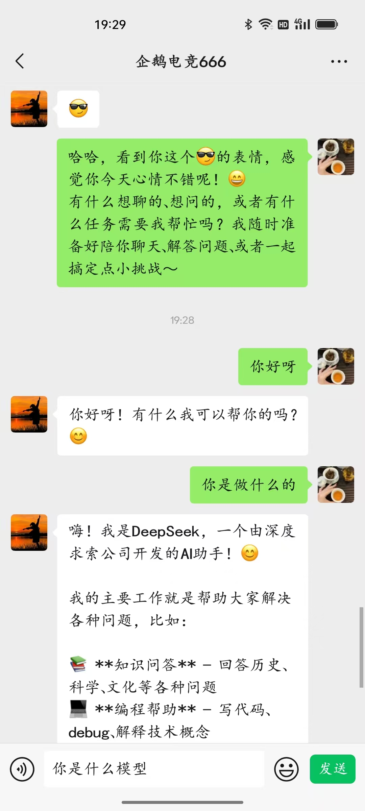
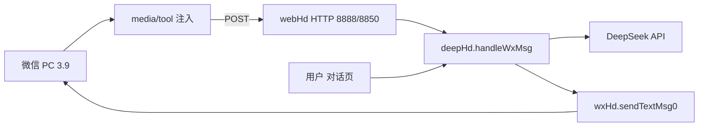

# deepWeChat

开源一个 Python 项目，让大家可以直接通过微信 + 自己申请的 DeepSeek 用微信聊天。

不用去腾讯那里申请注册什么，微信登录电脑就可以直接用，让好友直接问你问题、由 AI 回答，开源给大家学习使用。

目前演示所用的微信版本是 **3.9.12.55**。如果找不到可以去 [wechat-windows-versions](https://github.com/tom-snow/wechat-windows-versions) 下载。

---

微信 PC 3.9 Hook + DeepSeek 智能对话/自动回复桌面工具。主程序源码在 `pyqtMain/`，打包产物为 **DSKJ.exe**（与截图一致）。仓库根目录的 **WeDo.exe** 用于绕过微信 3.9 低版本登录限制，与主程序配合使用。

---

## 截图说明（`readMe/`）

| 文件 | 说明 |
|------|------|
| [readMe/wedo.png](readMe/wedo.png) | **WeDo.exe** 界面：过微信 3.9 低版本登录限制 |
| [readMe/DSKJ1.png](readMe/DSKJ1.png) | **DSKJ.exe**「对话」页：DeepSeek 聊天气泡、输入框、发送 |
| [readMe/DSKJ2.png](readMe/DSKJ2.png) | **DSKJ.exe**「设置」页：API Key、群选择、Hook 模式、不理会名单等 |
| [readMe/wei.jpg](readMe/wei.jpg) | 微信侧效果参考（与 DSKJ1 类似的群聊场景） |

### WeDo — 登录辅助

根目录 **WeDo.exe** 对应 `wedo.png`：在官方要求较高版本时，用于 **微信 3.9 低版本仍可登录**。建议先按 WeDo 说明完成登录，再启动 DSKJ 做 Hook 与自动回复。



### DSKJ — 对话页



- 展示 Hook 入站消息与 DeepSeek 回复（气泡样式）
- **清除消息**：清空对话区与本地 `chat_history.json`
- **发送**：仅写入对话区并请求 DeepSeek，**不会**转发到微信接单群
- 快捷键：`Ctrl+Enter` 发送，`Shift+Enter` 换行

### DSKJ — 设置页



- **DeepSeek API Key**：写入 `config["set_1"]["apiKey"]`
- **接单群 / 飞单群**：刷新群列表后选择，用于 Hook 监听范围
- **微信 Hook 自动回复**：勾选后群/个人消息才会走 `handleWxMsg`
- **微信控制模式**：Hook 模式 1 / 2（切换需重启，见下文）
- **不理会名单**、**发送间隔** 等与微信发消息队列相关

### 微信侧参考



---

## 功能概览

| 能力 | 说明 |
|------|------|
| DeepSeek 对话 | `deepHd` + `deepseek_client`，支持 API Key 配置与历史记录 |
| 微信 Hook 自动回复 | `webHd` 收 HTTP 回调 → `handleWxMsg` → DeepSeek → `sendTextMsg0` 回微信 |
| 双 Hook 模式 | 模式 1：端口 **8888**，API `127.0.0.1:1234`；模式 2：端口 **8850**，API `127.0.0.1:19088/api/` |
| 群/个人开关 | `wxHui1` 接单群、`wxHui2` 个人；`set_3` 不理会名单 |
| 发送节流 | `config["more"]` 中 `waitSd` / `wTime` / `lsTime`，由 `wxHd.sendTextMsg0` 排队 |

对话框与微信 **分离**：手动发送只更新 UI；只有 Hook 入站消息会回发到所选群/联系人。

---

## 目录结构

```
deepWeChat/
├── WeDo.exe              # 微信 3.9 低版本登录辅助（见 readMe/wedo.png）
├── README.md
├── readMe/               # 说明用截图
│   ├── wedo.png
│   ├── DSKJ1.png
│   ├── DSKJ2.png
│   └── wei.jpg
└── pyqtMain/             # 主程序源码（打包名 DSKJ）
    ├── main.py           # 入口：MainWindow = wxHandle + deepHandle
    ├── main.ui / Ui_main.py
    ├── wxHd.py           # 微信注入、群列表、发消息
    ├── webHd.py          # Hook HTTP 服务（8888 / 8850）
    ├── deepHd.py         # DeepSeek 对话与 Hook 自动回复
    ├── deepseek_client.py
    ├── config.py         # 默认配置（set_1 / set_3 / more 等）
    ├── dataHd.py         # 配置读写
    ├── ui_style.py       # 全局 QSS
    ├── common_init.py    # 路径、GM 全局、API 基址
    ├── media/            # 运行时需要（tool 注入程序、dll、提示音等）
    │   ├── tool/         # CInjectTool、ConsoleApp4、WeChatApis.dll 等
    │   └── audio/
    ├── pack.bat          # pyinstaller 生成 DSKJ.exe
    └── turnUi.bat        # pyuic5 由 main.ui 生成 Ui_main.py
```

---

## 环境与运行

### 依赖（开发）

在 `pyqtMain` 目录下安装常用依赖，例如：

```bash
pip install PyQt5 requests pywin32 pyperclip paramiko
```

DeepSeek 可选用官方 `deepseek` SDK；未安装时 `deepseek_client` 会走 HTTP 兼容实现（需有效 API Key）。

### 从源码运行

```bash
cd pyqtMain
python main.py
```

**注意**：工作目录应为 `pyqtMain`，以便正确加载 `media/`、`config` 数据文件与 `chat_history.json`。

### 打包为 DSKJ.exe

```bash
cd pyqtMain
pack.bat
```

生成单文件 **DSKJ.exe**（无控制台窗口）。发布时需将 **`media` 整个文件夹** 与 exe 放在同一目录（与开发时一致）。

---

## 推荐使用流程

1. 使用 **WeDo.exe** 完成微信 3.9 登录（若遇低版本限制）。
2. 启动 **DSKJ.exe**（或 `python main.py`）。
3. 打开 **设置** 页：
   - 填写 [DeepSeek API Key](https://platform.deepseek.com/api_keys) 并保存；
   - **刷新群列表**，选择接单群（及可选飞单群）；
   - 勾选 **微信 Hook 自动回复**；
   - 选择与当前注入方式一致的 **微信控制模式**（见下表）。
4. 若刚切换 Hook 模式，按提示 **重启软件**。
5. 在 **对话** 页查看入站消息与 AI 回复；可用清除消息、手动输入测试 DeepSeek（不回微信）。

---

## 微信 Hook 模式

| 模式 | UI 选项 | HTTP 监听 | 微信 API 基址 | 未连通时默认拉起 |
|------|---------|-----------|---------------|------------------|
| 1 | `rdbt_2_1` | `0.0.0.0:8888` | `http://127.0.0.1:1234/` | `CInjectTool.exe` 等（`media/tool`） |
| 2 | `rdbt_2_2` | `0.0.0.0:8850` | `http://127.0.0.1:19088/api/` | `ConsoleApp4.exe` 等 |

模式 2 回调 JSON 格式多样（`msglist`、扁平 `content`+`RoomName` 等），由 `webHd._normalize_hook_message` 统一后再交给 `deepHd.handleWxMsg`。

**务必**让注入端推送端口与上表一致，且接单群 wxid 与 Hook 里的 `RoomName` / 群 id 一致（设置页下拉为 `昵称|wxid` 格式）。

---

## 配置说明（`config.py` / 运行时持久化）

| 键 | 含义 |
|----|------|
| `set_1.hookMd` | `1` 或 `2`，Hook/API/监听端口 |
| `set_1.apiKey` | DeepSeek API Key |
| `set_1.jdQun` / `fdQun` | 接单群、飞单群（下拉项文本） |
| `set_1.wxHook` | 是否启用微信自动回复 |
| `set_1.wxHui1` / `wxHui2` | 是否回复群 / 个人 |
| `set_3` | 不理会名单（wxid 或昵称） |
| `more.waitSd` / `wTime` / `lsTime` | 发送间隔与队列 |

对话历史默认保存在 `pyqtMain/chat_history.json`（已在 `.gitignore` 中忽略）。

---

## 模块关系（简图）



---

## 开发备注

- 修改界面：编辑 `main.ui` 后执行 `pyuic5 -o Ui_main.py main.ui`（或 `turnUi.bat`）。
- 全局样式：`ui_style.py` 的 `APP_STYLESHEET`，在 `main.initUi` 中 `apply_app_style`。
- 窗口标题来自 `config["softName"]`（默认「ai微信直接聊」）+ `GM["version"]`。

wedo.exe,ConsoleApp2.exe,Dll1.dll 我放了一份在pyqtMain//dist//media//tool 所以打开DSKJ.exe可以直接用

有需要源码交流的可以联系我Q:3769886905

---

## 免责声明

本项目涉及微信 Hook 与第三方 API，仅供学习与研究。请遵守微信用户协议及相关法律法规，自行承担使用风险。
